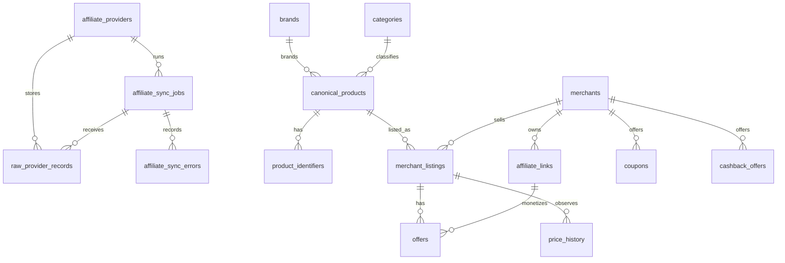

# Data Model

DealHunter separates product identity from merchant commerce data.

- `canonical_products` represent the shared product identity.
- `merchant_listings` represent merchant-specific catalog pages for a product.
- `offers` represent a purchasable commercial offer for a listing.
- `price_history` is append-only by observation and never overwrites historical prices.

Provider-specific raw payloads are stored only in `raw_provider_records`. Core product, merchant,
offer, coupon, cashback, and attribution fields are structured columns.

## Mermaid ERD

## Product Resolution

Deterministic matching is used only:

1. Exact global identifier: GTIN, UPC, EAN, or ISBN.
2. Exact brand plus MPN.
3. Exact provider-specific product mapping.
4. Otherwise create a product marked `unresolved_review`.

Uncertain products are not silently merged. LLM matching is intentionally out of scope.

## Source Attribution

Commercial records include provider source, source record ID, source timestamp, ingestion
timestamp, last successful update, freshness status, currency, market, and record status.

## Freshness Rules

The mock ingestion pipeline marks records older than 30 days as `stale` and skips commercial
upserts for them. Freshness policy is centralized in the ingestion service so future providers can
use provider-specific windows without changing the core schema.

## Current Tables

- `affiliate_providers`
- `merchants`
- `brands`
- `categories`
- `canonical_products`
- `product_identifiers`
- `merchant_listings`
- `affiliate_links`
- `offers`
- `price_history`
- `coupons`
- `cashback_offers`
- `affiliate_sync_jobs`
- `affiliate_sync_errors`
- `raw_provider_records`
- `products` from the initial foundation migration, retained for migration continuity.
