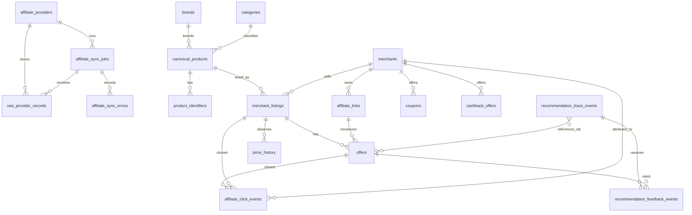

# Data Model

DealHunter separates product identity from merchant commerce data.

- `canonical_products` represent the shared product identity.
- `merchant_listings` represent merchant-specific catalog pages for a product.
- `offers` represent a purchasable commercial offer for a listing.
- `price_history` is append-only by observation and never overwrites historical prices.
- `affiliate_click_events` records lightweight mock click events for staging observability.
- `recommendation_trace_events` records deterministic recommendation traces for evaluation.
- `recommendation_feedback_events` records Helpful/Not helpful staging quality signals.

Provider-specific raw payloads are stored only in `raw_provider_records`. Core product, merchant,
offer, coupon, cashback, and attribution fields are structured columns.

## Mermaid ERD

```mermaid
erDiagram
  affiliate_providers ||--o{ affiliate_sync_jobs : runs
  affiliate_providers ||--o{ raw_provider_records : stores
  affiliate_sync_jobs ||--o{ raw_provider_records : receives
  affiliate_sync_jobs ||--o{ affiliate_sync_errors : records
  brands ||--o{ canonical_products : brands
  categories ||--o{ canonical_products : classifies
  canonical_products ||--o{ product_identifiers : has
  canonical_products ||--o{ merchant_listings : listed_as
  merchants ||--o{ merchant_listings : sells
  merchant_listings ||--o{ offers : has
  merchant_listings ||--o{ price_history : observes
  merchants ||--o{ affiliate_links : owns
  affiliate_links ||--o{ offers : monetizes
  merchants ||--o{ coupons : offers
  merchants ||--o{ cashback_offers : offers
  offers ||--o{ affiliate_click_events : clicked
  merchant_listings ||--o{ affiliate_click_events : clicked
  merchants ||--o{ affiliate_click_events : attributed_to
  recommendation_trace_events }o--o{ offers : references_ids
  recommendation_trace_events ||--o{ recommendation_feedback_events : receives
  offers ||--o{ recommendation_feedback_events : rated
```

## Product Resolution

Deterministic matching is used only:

1. Exact global identifier: GTIN, UPC, EAN, or ISBN.
2. Exact brand plus MPN.
3. Exact provider-specific product mapping.
4. Otherwise create a product marked `unresolved_review`.

Uncertain products are not silently merged. LLM matching is intentionally out of scope.

## Source Attribution

Commercial records include provider source, source record ID, source timestamp, ingestion
timestamp, last successful update, freshness status, currency, market, and record status.

## Freshness Rules

The mock ingestion pipeline marks records older than 30 days as `stale` and skips commercial
upserts for them. Freshness policy is centralized in the ingestion service so future providers can
use provider-specific windows without changing the core schema.

## Click Events

`affiliate_click_events` stores staging click telemetry for mock product and mock affiliate URLs.
Each event keeps the offer/listing/merchant relationship, provider attribution, target type, target
URL, market, optional referrer, optional user agent, and creation timestamp. It does not store user
accounts, IP addresses, payment identifiers, or real affiliate conversion data.

## Recommendation Trace Events

`recommendation_trace_events` stores one row per recommendation request. It keeps the rule-based
strategy, raw intent, parsed intent JSON, result count, recommended offer IDs, trace steps, and
creation timestamp. It does not store users, IP addresses, tokens, or external model payloads.
Gate 4O surfaces current rule, parser, ranker, and fixture versions through API responses and quality
exports; per-trace version columns are deferred until historical production trace semantics are
needed.

## Recommendation Feedback Events

`recommendation_feedback_events` stores one staging quality signal per submitted recommendation
rating. Each event keeps trace ID, offer ID, rating, source, provider source, market, optional reason,
and creation timestamp. It does not store user identity, session fingerprints, IP addresses, or
browser identifiers.

## Current Tables

- `affiliate_providers`
- `merchants`
- `brands`
- `categories`
- `canonical_products`
- `product_identifiers`
- `merchant_listings`
- `affiliate_links`
- `offers`
- `price_history`
- `coupons`
- `cashback_offers`
- `affiliate_click_events`
- `recommendation_trace_events`
- `recommendation_feedback_events`
- `affiliate_sync_jobs`
- `affiliate_sync_errors`
- `raw_provider_records`
- `products` from the initial foundation migration, retained for migration continuity.
